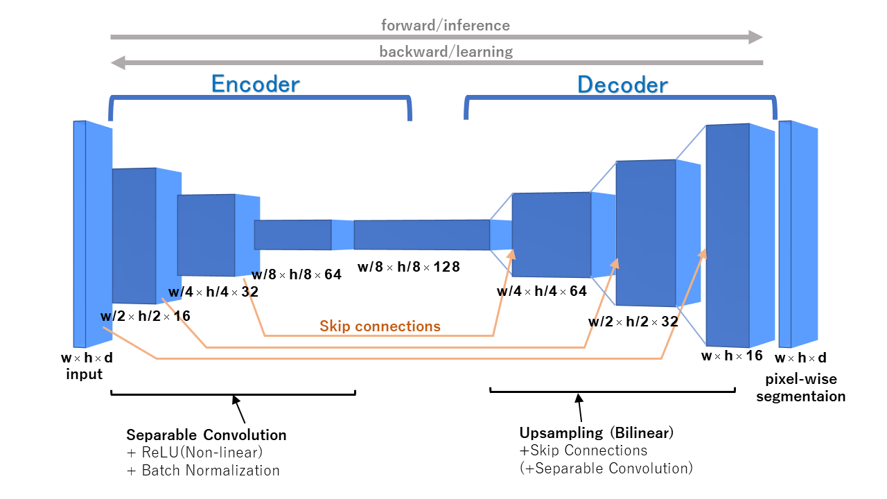
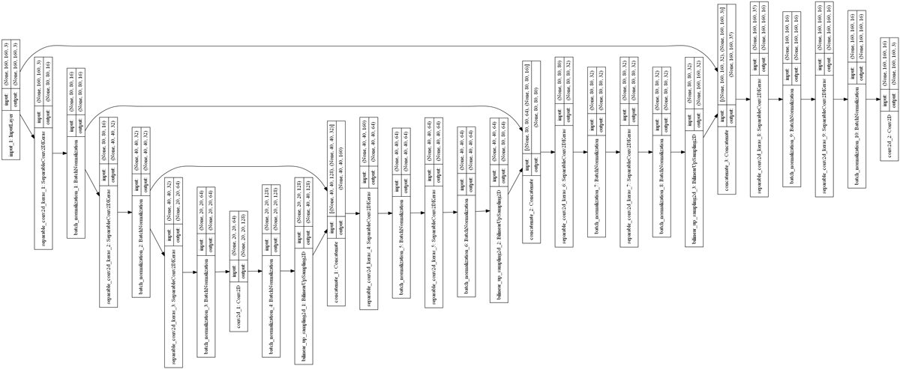
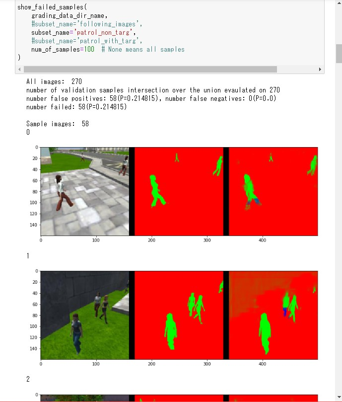
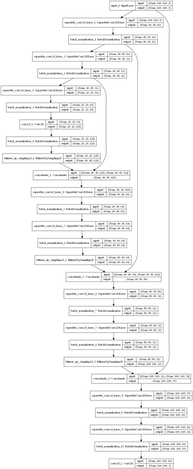
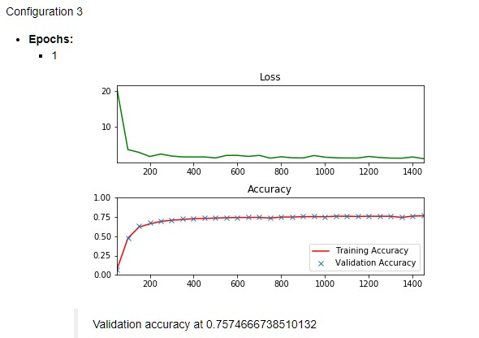
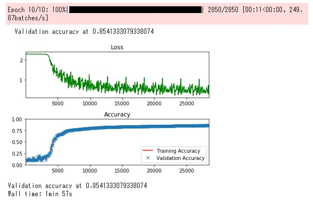
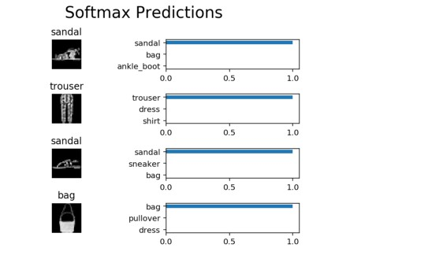
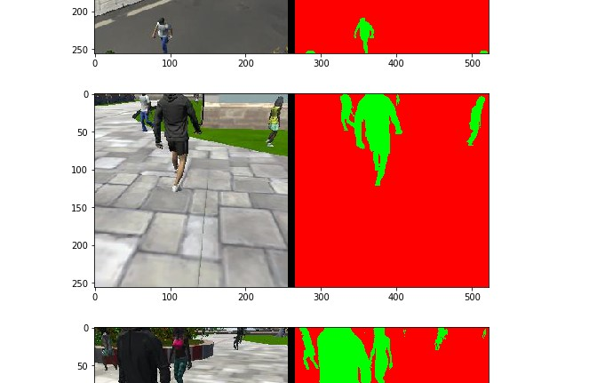

# Project: Follow Me

[](https://youtu.be/oDWhqEmxGBQ)

📄 [Click on image to see the simulator video.]((https://youtu.be/oDWhqEmxGBQ))

## Required steps to complete the project

TODOs:

* ✅ Clone the project repo [here](https://github.com/udacity/RoboND-DeepLearning-Project.git)
* ✅ Fill out the TODO's in the project code as mentioned this lesson.
* ✅ Optimize your network and hyper-parameters.
* ✅ Train your network and achieve an accuracy of 40% (0.40) using the Intersection over Union IoU metric which is final_grade_score at the bottom of your notebook.

    ```text
    > # And the final grade score is 
    > final_score = final_IoU * weight
    > print(final_score)
    0.404352116139
    ```

    [See details on notebook.](./code/model_training.html)

* ✅ Make a brief writeup report summarizing why you made the choices you did in building the network.

others:

* ✅ The file is in the correct format (.h5) and runs without errors.

  ⇒ 🎥 [See my video at online](https://youtu.be/oDWhqEmxGBQ).

  **📝NOTE:**

  * Please run below the command with CPU version of `tensorflow`. If you run it with GPU version,`tensorflow-gpu`, then it may hungup script!

    ```text
    cd code
    python follower.py model_weights
    ```

  * `--pred_viz` and visualization are disabled, because the function causes an below error in my environment.
  
    > from PyQt5 import QtGui, QtCore, QtWidgets
    > ImportError: DLL load failed: ...`

## About Environments

* **OS**: `Windows 10`
* **RAM**: 16GB
* **CPU for the running**: `Core i7-6700 @3.4GHz`
* **GPU for the training**: `NVIDIA GeForce GTX 970` (4GB)

💀 The increase limit of AWS GPU instances was not within time. This is the limit of human support at AWS, not the neural network.

## About the network architecture

[](./docs/images/network-model.png)

(Click to show the large with vertical)

[](./docs/images/model-vertical.png)

## About individual architectures

### 1 by 1 convolutions

The `1x1 convolutions` is the filter which pools the information, like a spartial information, for previous feature map. The filter does not changed  the width and height of the input.
As a result, `1x1 convolutions` can control the depth of the input for the next layer.

The `1x1` in `seprable convlution layer` that is called `pointwise convolution`, totaly reduce parameters, and then it can be expected to reduce the caluculation amount.

In this project, `1x1 convolutions` is used between `encoder layers` and `decoder layers`, and indirectly used in `seprable convlution layers`.

### Full connected layer

The target in this project is not basic classification that is called `semantic segmentation`. (But it's the classical problem of the computer vision...)

If the problem is the basic classification, like a dog or cat or.. then `fully connected layer` confirm to the part of the `decoder`. 

In that case, I think that we can use familiar machine learning methods like SVM in the decoder. 🤔

I feel that the solver is not necessarily complicated neural networks with high computational or expensive cost using hardwares like GPU for every problem.

## About hyper parameters

* In this project, I tuned parameters by human handing. (Human brute force? 🤔)
* **Batch Size**: 
  * `Batch Size` is must be not be too big, ex 500,1000,etc, and too small, ex 1,2.
  * Some parameters, ex 50 ,64, 100, are not bad and almost unchanged total performance.
  * 📝 **I mainly tried 50, based on the above reasons and the result of trials.**
* **Learning Rate**:
  * **High rate, ex 0.01, 0.05**, has fast convergence, but loss accuracy.
  * **Small rate, exe 0.001, 0.002**, has slow convergence, but accuracy of improves. It becomes disadvantageous when the number of trial is small like when epochs and steps are few.
  * 📝 As a result, in this time **I mainly tried value such as 0.002, 0.004. It's better accuracy for around 100 epochs** and for reasons of relistic time.
* **Epoch** and **Steps Per Epoch**:
  * 1 or 10 `epoch` is small to be accurate for this task, but good to try the model.
  * 📝 In my `learning rate`, I chose the converging value of `epoch`, ex 100, which is not too small.
* Validation Steps:
  * The default value is acceptable about accuracy.
* Workers:
  * Using computer resources as much as possible in my environemnt.
  * But GPU performance is more important things in this project.

📝 I referred ["Problem 3 of NN_lab"](https://github.com/tobynet/RoboND-NN-Lab/blob/master/NN_lab.ipynb).

Final settings of the hyperparameter:

```text
learning_rate = 0.004
batch_size = 50
num_epochs = 100
steps_per_epoch = 50
validation_steps = 50
workers = 4
```

## Other ingenuities and resources

* **[A tool for plotting FAILED predicted images](./code/plot-predicted-images.ipynb)**

  

  It's a tool that can see only images of `false positive` and `false negatives`.

* [Model visualizer](./code/plot_model.py) using keras vis_utils.

  The output example: (Click to large)

  [](./docs/images/model-vertical.png)

* **Labs in cources**:
  * ✅ [A notebook of NN-Lab](https://github.com/tobynet/RoboND-NN-Lab/blob/master/NN_lab.ipynb)

    

  * ✅ [A notebook of DNN-Lab](https://github.com/tobynet/RoboND-DNN-Lab/blob/master/DNN_lab.ipynb)

    

  * ✅: [A notebook of CNN-Lab](https://github.com/tobynet/RoboND-CNN-Lab/blob/master/CNN_lab.ipynb)

    

  * ✅: [A notebook of Segmentation-Lab](https://github.com/tobynet/RoboND-Segmentation-Lab/blob/master/code/segmentation_lab.ipynb)

    
